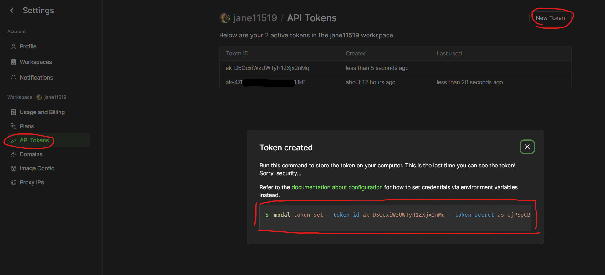
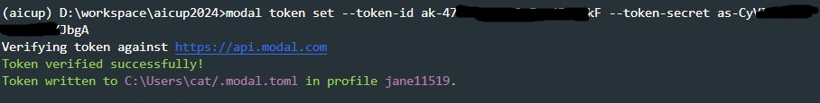
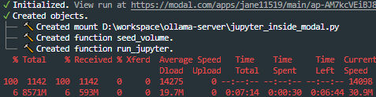
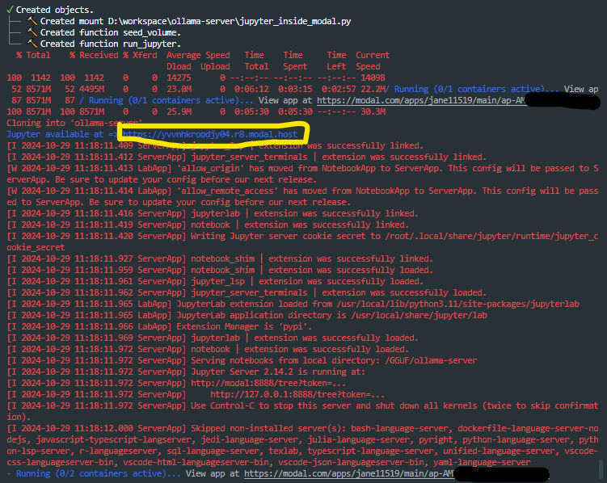
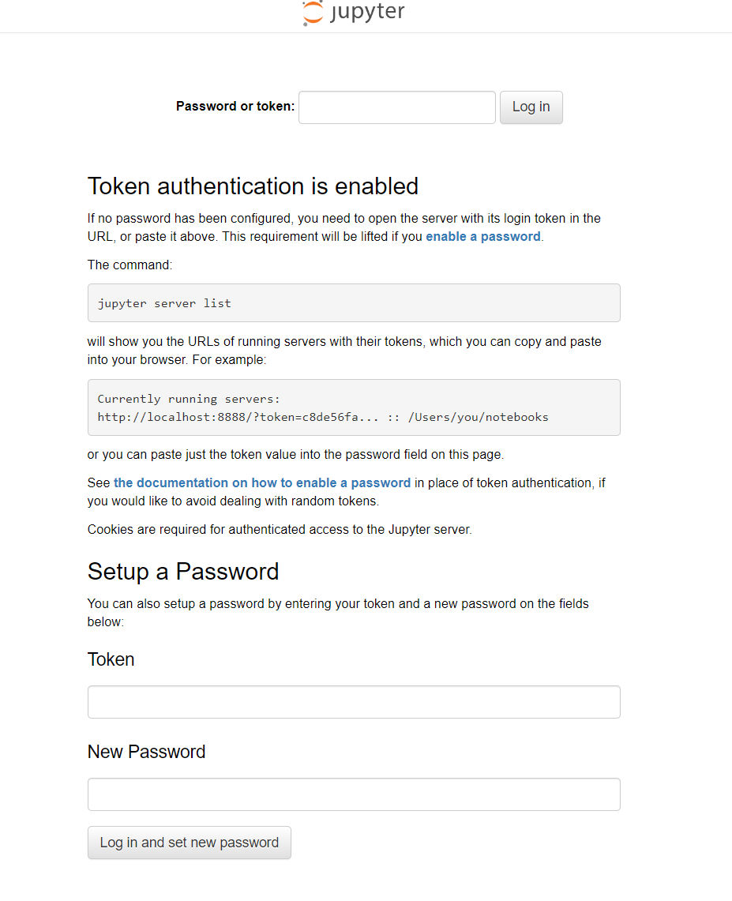
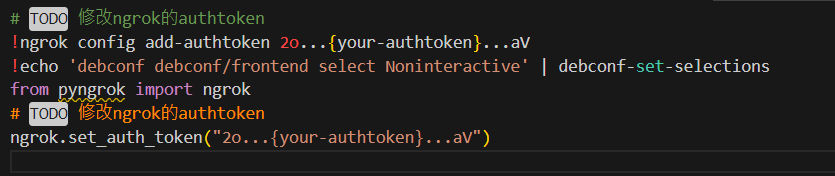
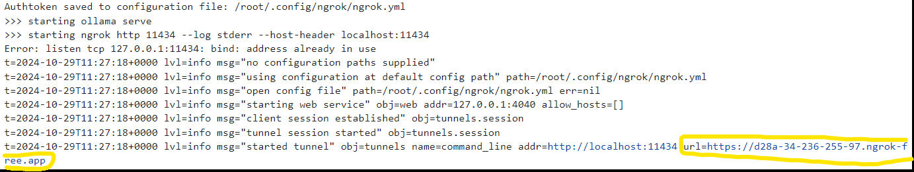
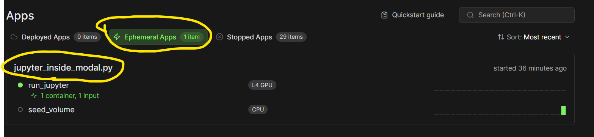
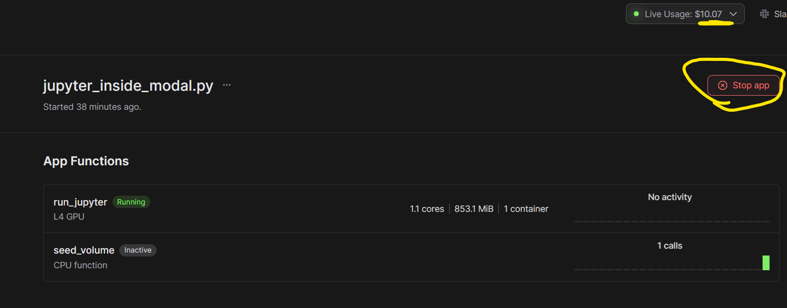

# 雲端平台 modal 使用免費GPU
modal給予每位用戶 $30/月 的免費計算積分，嘗試使用積分使用Jupyter啟動一個ollama的推斷伺服器，並透過ngrok穿透網路讓服務可以在自己的電腦上呼叫。
收費標準(截2024-10-29 請依網站為準)
https://modal.com/pricing
| GPU Tasks          | Price      |
| ------------------ | ---------- |
| Nvidia H100        | $4.56 / h  |
| Nvidia A100, 80 GB | $3.40 / h  |
| Nvidia A100, 40 GB | $2.78 / h  |
| Nvidia A10G        | $1.10 / h  |
| Nvidia L4          | $0.80 / h  |
| Nvidia T4          | $0.59 / h| |

# Modal設定

## 安裝本機套件
在python中安裝modal套件
``` shell
pip install modal
```
## 設定API key
至[[https://modal.com/]]註冊帳號後，前往設定中的API Tokens建立新的Tokens以後使用以下指令設定

```
modal token set --token-id ak-47N4...kF --token-secret as-CyVI...bgA
```
設定後會進行驗證


## 啟動遠端的Jupyter
在本地端輸入來啟動遠端容器
``` shell
modal run jupyter_inside_modal.py
```
容器建立時會同時建立Volume來下載並保存GGUF，這樣之後就不用再次下載，同時也會去clone要啟動ollama的相關jupyter


完成下載與建置後會看到jupyter的進入URL


進入後輸入設定的JUPYTER_TOKEN


進入modal-ollama-server.ipynb後
需修改最後一個cell中ngrok的authtoken

前往 https://ngrok.com/ 建立一個帳號後
前往 https://dashboard.ngrok.com/get-started/your-authtoken 取的你的authtoken


修改完成後就<span style="background:#fff88f">從頭執行所有cell</span>

執行後無錯誤就會看到映射到ollama服務的url


## 使用open ai 套件呼叫

範例:
``` python
from openai import OpenAI
client = OpenAI(base_url="https://d28a-34-236-255-97.ngrok-free.app/v1", api_key="ollama")
completion = client.chat.completions.create(
	model="Qwen2.5-14B-Instruct-Q4_K_M",
	messages=[
		{"role": "system", "content": systemp_prompt},
		{"role": "user", "content": content}
	],
	temperature=1,
)
response_content = completion.choices[0].message.content
print(response_content)
```

## 如何關閉服務避免繼續消耗積分
如果要關閉會發現一開始在本地執行的modal run jupyter_inside_modal.py無法終止

前往 https://modal.com/apps



Stop app即可終止

